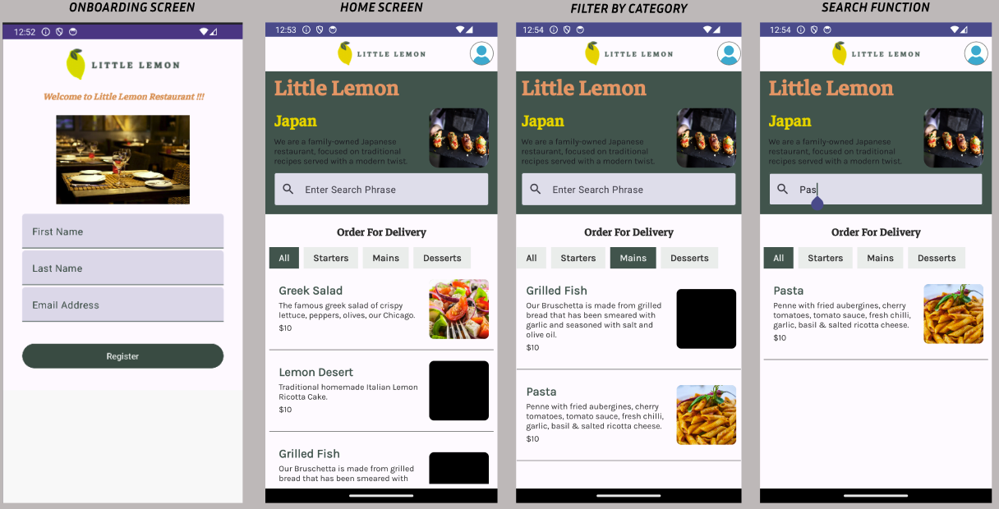
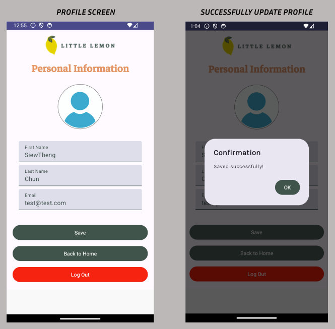

# 🍋 Little Lemon App 🍋

The Little Lemon app allows customers to browse, search, and order food for delivery/pickup from a fictional restaurant. It was built as the capstone project for the Meta Android Developer Specialization (Coursera).

## Overview 📝
The key features include:
* Account creation
* Browsing menu by category
* Searching for dishes by name
* Customising user profile

## Screenshots 📸

## Tech Stack 💻
* Kotlin
* Jetpack Compose
* Navigation Component
* ViewModel
* Room Database
* Kotlin Serialisation
* Ktor HttpClient
* Glide Compose
* SharedPreferences

## Running the Project ▶️
The app can be tested on android stimulator.
1. Clone the repository
2. Open the project with Android Studio
3. Click the Run button to build and run the project

### Key Learnings 🗝️
* Jetpack Compose: Implemented UI using composable functions, managed state with remember and mutableStateOf.
* Navigation: Setting up and navigating between different destinations using NavHost.
* Room Database: Set up and utilized Room for local storage of MenuItemEntity data.
* Networking: Used Ktor's HttpClient to fetch menu data from a JSON API endpoint.
* Serialisation: Serialized JSON data to Kotlin data classes using Kotlin Serialization.
* Asynchronous Programming: Using LaunchedEffect and DisposableEffect for fetching and updating data asynchronously.
* UI Design: Creating responsive layouts using modifiers (Modifier), handling user input with TextField and Button.

### Challenges 🚧
* Data Management: Managed data flow between network requests, Room database, and UI.
* Error Handling: Implemented error handling for network requests and database operations.
* Integration: Integrating Glide for image loading in Compose.
* State Management: Handling state changes across multiple composables.

### Future Enhancements 🚀
* Implement account authentication with login
    * Allow users to create accounts and log in using email/password or social media login APIs. This provides secure access to their profile and order history.
* Add items to a persistent cart
    * Enable users to add menu items to a cart that persists between sessions. They can view and edit the cart before checkout.
* Build out dish details pages
    * Individual dish pages could show ingredients, full descriptions, photos, and reviews. Users could add items directly to their cart from these pages.
* Integrate a payment API
    * Process orders by integrating a payment platform like Stripe to accept credit card payments securely within the app.
* Incorporate reservation functionality
    * Allow customers to book and manage upcoming reservations directly through the app interface.
* Implement push notifications
    * Send push notifications to notify users of reservation confirmations, order status updates and special deals.
